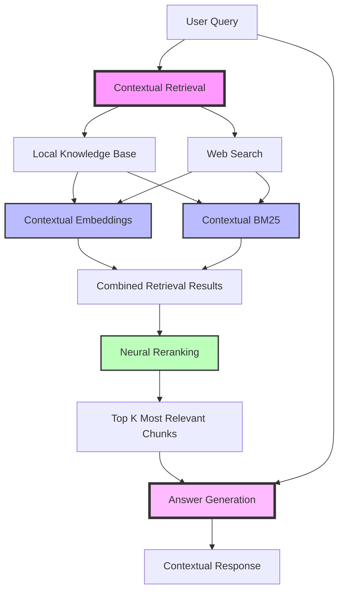

# rag-men
A Contextual RAG Bot Framework

# Contextual RAG System

## Overview

Contextual RAG (Retrieval-Augmented Generation) is an improved method for enhancing AI models with external knowledge, introduced by Anthropic. According to the article, it offers significant advantages over traditional RAG approaches:

1. Contextual Embeddings: Instead of simply embedding chunks of text, Contextual RAG prepends chunk-specific explanatory context before embedding. This helps preserve important contextual information that might otherwise be lost.

2. Contextual BM25: The method also applies context to the BM25 indexing process, improving lexical matching.

3. Performance Improvements: Combining Contextual Embeddings and Contextual BM25 reduced the top-20-chunk retrieval failure rate by 49% (from 5.7% to 2.9%) compared to traditional RAG methods.

4. Reranking: When combined with a reranking step, the retrieval failure rate was further reduced by 67% (from 5.7% to 1.9%).

5. Preservation of Context: Unlike traditional RAG, which often loses context when splitting documents into chunks, Contextual RAG maintains important contextual information, leading to more accurate and relevant retrievals.

6. Efficient Implementation: Anthropic's approach allows for cost-effective implementation using prompt caching, making it feasible for large-scale applications.

The article suggests that Contextual RAG is particularly effective for handling complex, multi-turn conversations and large contexts, where traditional RAG methods often struggle. This improvement in retrieval accuracy directly translates to better performance in downstream tasks, making it a significant advancement in the field of AI-powered information retrieval and generation.

[Source: Anthropic - Introducing Contextual Retrieval](https://www.anthropic.com/news/contextual-retrieval)

## The Key Idea

1. **Contextual Embeddings**: Prepends chunk-specific explanatory context before embedding, preserving important contextual information.
2. **Contextual BM25**: Applies context to the BM25 indexing process, improving lexical matching.
3. **Performance Improvements**: Reduces retrieval failure rates significantly compared to traditional RAG methods.
4. **Preservation of Context**: Maintains important contextual information when splitting documents into chunks.
5. **Efficient Implementation**: Allows for cost-effective implementation using prompt caching.

Contextual RAG is particularly effective for handling complex, multi-turn conversations and large contexts, where traditional RAG methods often struggle.

### How does it work?




## Features

1. **Local Knowledge Base**
   - Store and manage documents in a vector database (Chroma)
   - Add, remove, and update documents in the knowledge base
   - Efficient retrieval using similarity search

2. **Web Search Integration**
   - Incorporate up-to-date information from the web
   - Use DuckDuckGo for privacy-focused web searches

3. **Contextual Embeddings**
   - Generate embeddings using Ollama's local LLM
   - Consider both query and document context for improved relevance

4. **Contextual BM25 Scoring**
   - Implement a custom BM25 algorithm that considers context
   - Score both local documents and web search results

5. **Neural Reranking**
   - Use Ollama to rerank results based on relevance to the query and context
   - Combine vector similarity, BM25 scores, and neural reranking for optimal results

6. **Answer Generation**
   - Generate comprehensive answers using Ollama
   - Consider both local knowledge and web search results

7. **Command-line Interface**
   - Interactive mode for querying and managing the knowledge base
   - Option to list knowledge base contents

## Implementation Details

### Vector Store (src/retriever/vector_store.py)
- Uses Chroma as the underlying vector database
- Implements add, remove, update, and query operations

### Contextual Embeddings (src/retriever/contextual_embeddings.py)
- Utilizes Ollama to generate embeddings
- Considers both the text and its context

### Contextual BM25 (src/retriever/contextual_bm25.py)
- Custom implementation of the BM25 algorithm
- Dynamically updates with new documents for each query

### Web Search (src/search/web_search.py)
- Integrates DuckDuckGo for web searches
- Returns relevant snippets and URLs

### Reranker (src/reranker/reranker.py)
- Uses Ollama to score the relevance of results
- Considers query, context, and document content

### Answer Generator (src/generator/answer_generator.py)
- Leverages Ollama to generate comprehensive answers
- Incorporates information from top-ranked results

### Pipeline (src/pipeline/contextual_rag_pipeline.py)
- Orchestrates the entire retrieval and generation process
- Combines local knowledge, web search, and various scoring mechanisms

## Usage

1. Install dependencies:
   ```
   pip install -r requirements.txt
   ```

2. Run the main script:
   ```
   python main.py
   ```

3. Use command-line options:
   - List knowledge base contents:
     ```
     python main.py --list_kb
     ```

4. In interactive mode:
   - Upload documents to the knowledge base
   - Query the system
   - List knowledge base contents
   - Exit the program

## Future Improvements

- Implement document chunking for handling larger texts
- Add support for multiple vector stores and LLM providers
- Improve error handling and logging
- Develop a web interface for easier interaction
- Implement caching mechanisms for improved performance

## License

This project is licensed under the MIT License - see the LICENSE file for details.

[](https://github.com/yguo/)